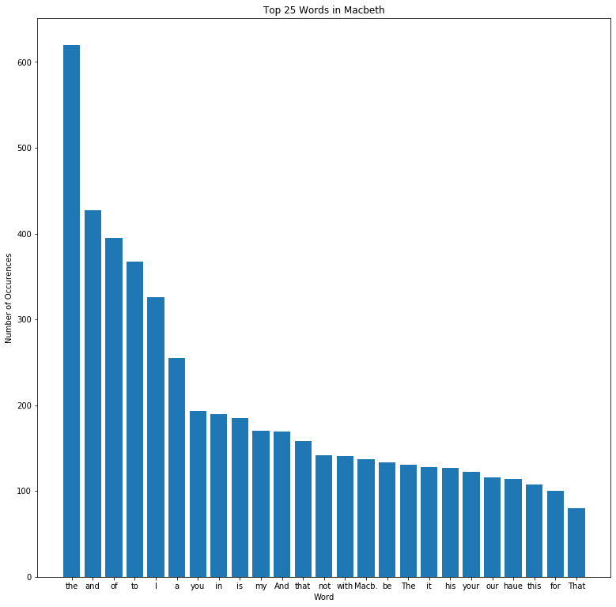

# Project: Analyzing Macbeth Using NLP


```python
import requests
macbeth = requests.get('http://www.gutenberg.org/cache/epub/2264/pg2264.txt').text

print(type(macbeth))
print(len(macbeth))
print(macbeth[:500])
```

    <class 'str'>
    120253
    
    
    ***The Project Gutenberg's Etext of Shakespeare's First Folio***
    ********************The Tragedie of Macbeth*********************
    
    
    
    *******************************************************************
    THIS EBOOK WAS ONE OF PROJECT GUTENBERG'S EARLY FILES PRODUCED AT A
    TIME WHEN PROOFING METHODS AND TOOLS WERE NOT WELL DEVELOPED. THERE
    IS AN IMPROVED EDITION OF THIS TITLE WHICH MAY BE VIEWED AS EBOOK
    (#1533) at https://www.gutenberg.org/ebooks/1533
    *********************************


```python
import numpy as np
import matplotlib.pyplot as plt
%matplotlib inline

words = macbeth.split()
word_counts = {}
for word in words:
    word_counts[word] = word_counts.get(word, 0) + 1
    
counts = list(word_counts.items())
top_25 = sorted(counts, key = lambda x: x[1], reverse=True)[:25]
y = [item[1] for item in top_25]
X = np.arange(len(y))
plt.figure(figsize=(13,13))
plt.bar(X , y)
plt.xticks(X, [item[0] for item in top_25]);
plt.ylabel('Number of Occurences')
plt.xlabel('Word')
plt.title('Top 25 Words in Macbeth')
```


    Text(0.5, 1.0, 'Top 25 Words in Macbeth')





```python
import nltk
from nltk.corpus import stopwords
from nltk.collocations import *
from nltk import FreqDist
from nltk import word_tokenize
import string
import re
```


```python
pattern = "([a-zA-Z]+(?:'[a-z]+)?)"
macbeth_tokens_raw = nltk.regexp_tokenize(macbeth, pattern)
macbeth_tokens = [word.lower() for word in macbeth_tokens_raw]
```


```python
macbeth_freqdist = FreqDist(macbeth_tokens)
macbeth_freqdist.most_common(50)
```


    [('the', 764),
     ('and', 603),
     ('to', 460),
     ('of', 428),
     ('i', 344),
     ('a', 287),
     ('you', 269),
     ('that', 245),
     ('in', 225),
     ('is', 213),
     ('my', 207),
     ('it', 185),
     ('not', 182),
     ('with', 162),
     ('this', 159),
     ('be', 153),
     ('his', 147),
     ('for', 139),
     ('your', 139),
     ('macb', 137),
     ('our', 136),
     ('but', 126),
     ('haue', 122),
     ('me', 115),
     ('all', 112),
     ('he', 112),
     ('what', 110),
     ('as', 109),
     ('so', 108),
     ('we', 100),
     ('him', 92),
     ('are', 89),
     ('thou', 87),
     ('or', 85),
     ('which', 83),
     ('enter', 81),
     ('will', 80),
     ('they', 79),
     ('by', 74),
     ('no', 73),
     ('from', 71),
     ('on', 70),
     ('if', 68),
     ('shall', 68),
     ('macbeth', 67),
     ('then', 67),
     ('at', 66),
     ('their', 62),
     ('thee', 61),
     ('more', 58)]


```python
stopwords_list = stopwords.words('english')
stopwords_list += list(string.punctuation)
stopwords_list += ['0', '1', '2', '3', '4', '5', '6', '7', '8', '9', 'project', 'gutenberg', 'carnegie', 'mellon',
                  'university', 'print', 'statement', 'small']

macbeth_words_stopped = [word for word in macbeth_tokens if word not in stopwords_list]
```


```python
macbeth_stopped_freqdist = FreqDist(macbeth_words_stopped)
macbeth_stopped_freqdist.most_common(50)
```


    [('macb', 137),
     ('haue', 122),
     ('thou', 87),
     ('enter', 81),
     ('shall', 68),
     ('macbeth', 67),
     ('thee', 61),
     ('vpon', 58),
     ('macd', 58),
     ('yet', 57),
     ('come', 56),
     ('thy', 56),
     ('king', 55),
     ('vs', 55),
     ('time', 54),
     ('hath', 52),
     ('may', 51),
     ('good', 50),
     ('rosse', 49),
     ('would', 48),
     ('lady', 48),
     ('like', 45),
     ('one', 44),
     ('make', 39),
     ('say', 39),
     ('must', 38),
     ('doe', 38),
     ('lord', 38),
     ('see', 37),
     ('tis', 37),
     ('selfe', 36),
     ('etext', 35),
     ('done', 35),
     ('ile', 35),
     ('feare', 35),
     ('let', 35),
     ('well', 34),
     ('know', 34),
     ('man', 34),
     ('wife', 34),
     ('night', 34),
     ('banquo', 34),
     ('great', 32),
     ('exeunt', 30),
     ('speake', 29),
     ('sir', 29),
     ('lenox', 28),
     ('things', 27),
     ('mine', 26),
     ('vp', 26)]


```python
len(macbeth_stopped_freqdist)
```


    3975


```python
total_word_count = sum(macbeth_stopped_freqdist.values())
macbeth_top_50 = macbeth_stopped_freqdist.most_common(50)
print('Word\t\t\tNormalized Frequency')
for word in macbeth_top_50:
    normalized_frequency = word[1] / total_word_count
    print('{} \t\t\t {:.4}'.format(word[0], normalized_frequency))
```

    Word			Normalized Frequency
    macb 			 0.012
    haue 			 0.01069
    thou 			 0.007623
    enter 			 0.007097
    shall 			 0.005958
    macbeth 			 0.00587
    thee 			 0.005345
    vpon 			 0.005082
    macd 			 0.005082
    yet 			 0.004994
    come 			 0.004907
    thy 			 0.004907
    king 			 0.004819
    vs 			 0.004819
    time 			 0.004731
    hath 			 0.004556
    may 			 0.004469
    good 			 0.004381
    rosse 			 0.004293
    would 			 0.004206
    lady 			 0.004206
    like 			 0.003943
    one 			 0.003855
    make 			 0.003417
    say 			 0.003417
    must 			 0.00333
    doe 			 0.00333
    lord 			 0.00333
    see 			 0.003242
    tis 			 0.003242
    selfe 			 0.003154
    etext 			 0.003067
    done 			 0.003067
    ile 			 0.003067
    feare 			 0.003067
    let 			 0.003067
    well 			 0.002979
    know 			 0.002979
    man 			 0.002979
    wife 			 0.002979
    night 			 0.002979
    banquo 			 0.002979
    great 			 0.002804
    exeunt 			 0.002629
    speake 			 0.002541
    sir 			 0.002541
    lenox 			 0.002453
    things 			 0.002366
    mine 			 0.002278
    vp 			 0.002278


```python
bigram_measures = nltk.collocations.BigramAssocMeasures()
```


```python
macbeth_finder = BigramCollocationFinder.from_words(macbeth_words_stopped)
```


```python
macbeth_scored = macbeth_finder.score_ngrams(bigram_measures.raw_freq)
```


```python
macbeth_scored[:50]
```


    [(('enter', 'macbeth'), 0.0014019101025146764),
     (('exeunt', 'scena'), 0.001314290721107509),
     (('thane', 'cawdor'), 0.0011390519582931745),
     (('knock', 'knock'), 0.0008761938140716726),
     (('lord', 'macb'), 0.0007885744326645054),
     (('thou', 'art'), 0.0007885744326645054),
     (('good', 'lord'), 0.0007009550512573382),
     (('haue', 'done'), 0.0007009550512573382),
     (('macb', 'haue'), 0.0007009550512573382),
     (('enter', 'lady'), 0.0006133356698501709),
     (('first', 'folio'), 0.0006133356698501709),
     (('let', 'vs'), 0.0006133356698501709),
     (('tragedie', 'macbeth'), 0.0006133356698501709),
     (('macbeth', 'macb'), 0.0005257162884430036),
     (('public', 'domain'), 0.0005257162884430036),
     (('enter', 'malcolme'), 0.0004380969070358363),
     (('enter', 'three'), 0.0004380969070358363),
     (('euery', 'one'), 0.0004380969070358363),
     (('macb', 'ile'), 0.0004380969070358363),
     (('macb', 'thou'), 0.0004380969070358363),
     (('make', 'vs'), 0.0004380969070358363),
     (('mine', 'eyes'), 0.0004380969070358363),
     (('mine', 'owne'), 0.0004380969070358363),
     (('scena', 'secunda'), 0.0004380969070358363),
     (('ten', 'thousand'), 0.0004380969070358363),
     (('three', 'witches'), 0.0004380969070358363),
     (('thy', 'selfe'), 0.0004380969070358363),
     (('worthy', 'thane'), 0.0004380969070358363),
     (('would', 'haue'), 0.0004380969070358363),
     (('among', 'things'), 0.0003504775256286691),
     (('borne', 'woman'), 0.0003504775256286691),
     (('come', 'come'), 0.0003504775256286691),
     (('enter', 'banquo'), 0.0003504775256286691),
     (('enter', 'king'), 0.0003504775256286691),
     (('enter', 'macduffe'), 0.0003504775256286691),
     (('enter', 'rosse'), 0.0003504775256286691),
     (('etext', "shakespeare's"), 0.0003504775256286691),
     (('haile', 'king'), 0.0003504775256286691),
     (('haile', 'macbeth'), 0.0003504775256286691),
     (('hath', 'made'), 0.0003504775256286691),
     (('haue', 'seene'), 0.0003504775256286691),
     (('macb', 'bring'), 0.0003504775256286691),
     (('macbeth', 'macbeth'), 0.0003504775256286691),
     (('malcolme', 'donalbaine'), 0.0003504775256286691),
     (('may', 'see'), 0.0003504775256286691),
     (('old', 'man'), 0.0003504775256286691),
     (('rosse', 'angus'), 0.0003504775256286691),
     (('scena', 'prima'), 0.0003504775256286691),
     (('see', 'thee'), 0.0003504775256286691),
     (("shakespeare's", 'first'), 0.0003504775256286691)]


```python
macbeth_pmi_finder = BigramCollocationFinder.from_words(macbeth_words_stopped)
macbeth_pmi_finder.apply_freq_filter(5)
```


```python
macbeth_pmi_scored = macbeth_pmi_finder.score_ngrams(bigram_measures.pmi)
macbeth_pmi_scored
```


    [(('public', 'domain'), 10.893427944445829),
     (('ten', 'thousand'), 10.893427944445829),
     (('scena', 'secunda'), 9.018958826529687),
     (('first', 'folio'), 9.018958826529683),
     (('three', 'witches'), 8.992963617996743),
     (('knock', 'knock'), 8.800318540054345),
     (('thane', 'cawdor'), 8.14265655075459),
     (('exeunt', 'scena'), 8.018958826529687),
     (('mine', 'eyes'), 7.640447203275958),
     (('tragedie', 'macbeth'), 7.4123012547092095),
     (('worthy', 'thane'), 7.156462350279622),
     (('mine', 'owne'), 7.012415980662915),
     (('euery', 'one'), 6.3408869214170505),
     (('thou', 'art'), 6.0354469493182545),
     (('enter', 'malcolme'), 5.76002881902863),
     (('enter', 'three'), 5.653113615112119),
     (('good', 'lord'), 5.586606741948673),
     (('let', 'vs'), 5.37510263675496),
     (('enter', 'macbeth'), 5.072451251824585),
     (('thy', 'selfe'), 4.823038616554429),
     (('make', 'vs'), 4.733556607667438),
     (('haue', 'done'), 4.4183700906591294),
     (('enter', 'lady'), 4.360932863618805),
     (('lord', 'macb'), 4.302355850205185),
     (('macb', 'ile'), 3.5730034401488524),
     (('would', 'haue'), 3.2846187017703024),
     (('macbeth', 'macb'), 2.899231672469842),
     (('macb', 'haue'), 2.4496210246435695),
     (('macb', 'thou'), 2.2593429612450926)]


```python

```
