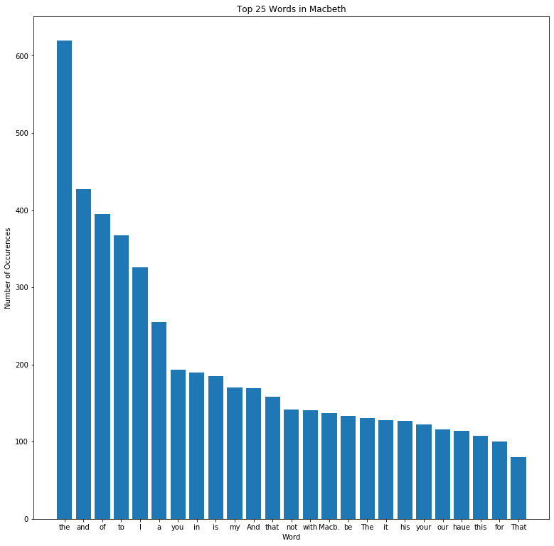

# Project: Analyzing Macbeth Using NLP


### In this project, I will use a variety of NLP techniques to create some corpus statistics in the exploration of Shakespeare's Macbeth. 

The first step, of course, is obtaining the corpus of Macbeth. I will be getting it from the Project Gutenberg website.


```python
import requests
macbeth = requests.get('http://www.gutenberg.org/cache/epub/2264/pg2264.txt').text

print(type(macbeth))
print(len(macbeth))
print(macbeth[:500])
```

    <class 'str'>
    120253
    
    
    ***The Project Gutenberg's Etext of Shakespeare's First Folio***
    ********************The Tragedie of Macbeth*********************
    
    
    
    *******************************************************************
    THIS EBOOK WAS ONE OF PROJECT GUTENBERG'S EARLY FILES PRODUCED AT A
    TIME WHEN PROOFING METHODS AND TOOLS WERE NOT WELL DEVELOPED. THERE
    IS AN IMPROVED EDITION OF THIS TITLE WHICH MAY BE VIEWED AS EBOOK
    (#1533) at https://www.gutenberg.org/ebooks/1533
    *********************************


Before performing the NLP work, I want to create a bar graph displaying the 25 most common words in Macbeth.


```python
import numpy as np
import matplotlib.pyplot as plt
%matplotlib inline

words = macbeth.split()
word_counts = {}
for word in words:
    word_counts[word] = word_counts.get(word, 0) + 1
    
counts = list(word_counts.items())
top_25 = sorted(counts, key = lambda x: x[1], reverse=True)[:25]
y = [item[1] for item in top_25]
X = np.arange(len(y))
plt.figure(figsize=(13,13))
plt.bar(X , y)
plt.xticks(X, [item[0] for item in top_25]);
plt.ylabel('Number of Occurences')
plt.xlabel('Word')
plt.title('Top 25 Words in Macbeth')
```


    Text(0.5, 1.0, 'Top 25 Words in Macbeth')





Obviously, there isn't too much value here because there are a lot of fluff words - 'the', 'and', 'of', etc. This displays why NLP is so useful and can be so meaningful!

First, I will import all necessary packages and use a regex pattern to help remove word tokens that contain apostrophes. I will also use some list comprehension to lowercase all the words in the corpus.


```python
import nltk
from nltk.corpus import stopwords
from nltk.collocations import *
from nltk import FreqDist
from nltk import word_tokenize
import string
import re
```


```python
pattern = "([a-zA-Z]+(?:'[a-z]+)?)"
macbeth_tokens_raw = nltk.regexp_tokenize(macbeth, pattern)
macbeth_tokens = [word.lower() for word in macbeth_tokens_raw]
```

Next, I will create a frequency distribution to see what the most common words are.


```python
macbeth_freqdist = FreqDist(macbeth_tokens)
macbeth_freqdist.most_common(50)
```


    [('the', 764),
     ('and', 603),
     ('to', 460),
     ('of', 428),
     ('i', 344),
     ('a', 287),
     ('you', 269),
     ('that', 245),
     ('in', 225),
     ('is', 213),
     ('my', 207),
     ('it', 185),
     ('not', 182),
     ('with', 162),
     ('this', 159),
     ('be', 153),
     ('his', 147),
     ('for', 139),
     ('your', 139),
     ('macb', 137),
     ('our', 136),
     ('but', 126),
     ('haue', 122),
     ('me', 115),
     ('all', 112),
     ('he', 112),
     ('what', 110),
     ('as', 109),
     ('so', 108),
     ('we', 100),
     ('him', 92),
     ('are', 89),
     ('thou', 87),
     ('or', 85),
     ('which', 83),
     ('enter', 81),
     ('will', 80),
     ('they', 79),
     ('by', 74),
     ('no', 73),
     ('from', 71),
     ('on', 70),
     ('if', 68),
     ('shall', 68),
     ('macbeth', 67),
     ('then', 67),
     ('at', 66),
     ('their', 62),
     ('thee', 61),
     ('more', 58)]


Similair to the bar graph, it's pretty apparent that the most common words in the text still don't provide very much value. So, I'm going to create a stopwords list, and then expand on that list to include any other words that aren't relevant to the story.


```python
stopwords_list = stopwords.words('english')
stopwords_list += list(string.punctuation)
stopwords_list += ['0', '1', '2', '3', '4', '5', '6', '7', '8', '9', 'project', 'gutenberg', 'carnegie', 'mellon',
                  'university', 'print', 'statement', 'small', 'public', 'domain']

macbeth_words_stopped = [word for word in macbeth_tokens if word not in stopwords_list]
```

Now, I'll redo the frequency distribution and see how much it changes


```python
macbeth_stopped_freqdist = FreqDist(macbeth_words_stopped)
macbeth_stopped_freqdist.most_common(50)
```


    [('macb', 137),
     ('haue', 122),
     ('thou', 87),
     ('enter', 81),
     ('shall', 68),
     ('macbeth', 67),
     ('thee', 61),
     ('vpon', 58),
     ('macd', 58),
     ('yet', 57),
     ('come', 56),
     ('thy', 56),
     ('king', 55),
     ('vs', 55),
     ('time', 54),
     ('hath', 52),
     ('may', 51),
     ('good', 50),
     ('rosse', 49),
     ('would', 48),
     ('lady', 48),
     ('like', 45),
     ('one', 44),
     ('make', 39),
     ('say', 39),
     ('must', 38),
     ('doe', 38),
     ('lord', 38),
     ('see', 37),
     ('tis', 37),
     ('selfe', 36),
     ('etext', 35),
     ('done', 35),
     ('ile', 35),
     ('feare', 35),
     ('let', 35),
     ('well', 34),
     ('know', 34),
     ('man', 34),
     ('wife', 34),
     ('night', 34),
     ('banquo', 34),
     ('great', 32),
     ('exeunt', 30),
     ('speake', 29),
     ('sir', 29),
     ('lenox', 28),
     ('things', 27),
     ('mine', 26),
     ('vp', 26)]


A pretty noticeable difference! The most common words of value in the story of Macbeth are "macb", "haue", and "thou". I'm not exactly sure if "macb" is used as a designation for him to speak or if it's like a nickname, but since I have not read the story, I will leave it be. "To be or not to be - that is the question."

It also appears that Macbeth contains 3,973 unique words of value.


```python
len(macbeth_stopped_freqdist)
```


    3973


So, we know what the most common words in Macbeth are along with how many times they are used. But, I think knowing how much each word is used when represented as a percentage of *all* the words of value would provide even more context into just how frequently each word is used. The step below will display this.


```python
total_word_count = sum(macbeth_stopped_freqdist.values())
macbeth_top_50 = macbeth_stopped_freqdist.most_common(50)
print('Word\t\t\tNormalized Frequency')
for word in macbeth_top_50:
    normalized_frequency = word[1] / total_word_count
    print('{} \t\t\t {:.4}'.format(word[0], normalized_frequency))
```

    Word			Normalized Frequency
    macb 			 0.01202
    haue 			 0.0107
    thou 			 0.007631
    enter 			 0.007105
    shall 			 0.005964
    macbeth 			 0.005877
    thee 			 0.00535
    vpon 			 0.005087
    macd 			 0.005087
    yet 			 0.005
    come 			 0.004912
    thy 			 0.004912
    king 			 0.004824
    vs 			 0.004824
    time 			 0.004736
    hath 			 0.004561
    may 			 0.004473
    good 			 0.004386
    rosse 			 0.004298
    would 			 0.00421
    lady 			 0.00421
    like 			 0.003947
    one 			 0.003859
    make 			 0.003421
    say 			 0.003421
    must 			 0.003333
    doe 			 0.003333
    lord 			 0.003333
    see 			 0.003245
    tis 			 0.003245
    selfe 			 0.003158
    etext 			 0.00307
    done 			 0.00307
    ile 			 0.00307
    feare 			 0.00307
    let 			 0.00307
    well 			 0.002982
    know 			 0.002982
    man 			 0.002982
    wife 			 0.002982
    night 			 0.002982
    banquo 			 0.002982
    great 			 0.002807
    exeunt 			 0.002631
    speake 			 0.002544
    sir 			 0.002544
    lenox 			 0.002456
    things 			 0.002368
    mine 			 0.002281
    vp 			 0.002281


Going back to the three most common words - macb, haue, and thou - we can see that:
* 'macb' represents 12% of the words used
* 'haue' represents 10.69% of the words used
* 'thou' represents 7.623% of the words used.

Just those three words combined make up 30.3% percent of the valuable text in Macbeth!

The next step I will be displaying is creating bigrams. For a respective word, bigrams essentially are a measurement what the probability of the next word will be given the initial word, based on text analysis/processing.


```python
bigram_measures = nltk.collocations.BigramAssocMeasures()
```


```python
macbeth_finder = BigramCollocationFinder.from_words(macbeth_words_stopped)
```


```python
macbeth_scored = macbeth_finder.score_ngrams(bigram_measures.raw_freq)
```


```python
macbeth_scored[:50]
```


    [(('enter', 'macbeth'), 0.0014033856679238662),
     (('exeunt', 'scena'), 0.0013156740636786246),
     (('thane', 'cawdor'), 0.0011402508551881414),
     (('knock', 'knock'), 0.0008771160424524164),
     (('lord', 'macb'), 0.0007894044382071748),
     (('thou', 'art'), 0.0007894044382071748),
     (('good', 'lord'), 0.0007016928339619331),
     (('haue', 'done'), 0.0007016928339619331),
     (('macb', 'haue'), 0.0007016928339619331),
     (('enter', 'lady'), 0.0006139812297166915),
     (('first', 'folio'), 0.0006139812297166915),
     (('let', 'vs'), 0.0006139812297166915),
     (('tragedie', 'macbeth'), 0.0006139812297166915),
     (('macbeth', 'macb'), 0.0005262696254714499),
     (('enter', 'malcolme'), 0.0004385580212262082),
     (('enter', 'three'), 0.0004385580212262082),
     (('euery', 'one'), 0.0004385580212262082),
     (('macb', 'ile'), 0.0004385580212262082),
     (('macb', 'thou'), 0.0004385580212262082),
     (('make', 'vs'), 0.0004385580212262082),
     (('mine', 'eyes'), 0.0004385580212262082),
     (('mine', 'owne'), 0.0004385580212262082),
     (('scena', 'secunda'), 0.0004385580212262082),
     (('ten', 'thousand'), 0.0004385580212262082),
     (('three', 'witches'), 0.0004385580212262082),
     (('thy', 'selfe'), 0.0004385580212262082),
     (('worthy', 'thane'), 0.0004385580212262082),
     (('would', 'haue'), 0.0004385580212262082),
     (('among', 'things'), 0.00035084641698096656),
     (('borne', 'woman'), 0.00035084641698096656),
     (('come', 'come'), 0.00035084641698096656),
     (('enter', 'banquo'), 0.00035084641698096656),
     (('enter', 'king'), 0.00035084641698096656),
     (('enter', 'macduffe'), 0.00035084641698096656),
     (('enter', 'rosse'), 0.00035084641698096656),
     (('etext', "shakespeare's"), 0.00035084641698096656),
     (('haile', 'king'), 0.00035084641698096656),
     (('haile', 'macbeth'), 0.00035084641698096656),
     (('hath', 'made'), 0.00035084641698096656),
     (('haue', 'seene'), 0.00035084641698096656),
     (('macb', 'bring'), 0.00035084641698096656),
     (('macbeth', 'macbeth'), 0.00035084641698096656),
     (('malcolme', 'donalbaine'), 0.00035084641698096656),
     (('may', 'see'), 0.00035084641698096656),
     (('old', 'man'), 0.00035084641698096656),
     (('rosse', 'angus'), 0.00035084641698096656),
     (('scena', 'prima'), 0.00035084641698096656),
     (('see', 'thee'), 0.00035084641698096656),
     (("shakespeare's", 'first'), 0.00035084641698096656),
     (('shew', 'shew'), 0.00035084641698096656)]


So, based on the analysis of Macbeth, the bigram results show that for the most probable combination of words would be 'enter macbeth'. The second most probable pairing would be 'exeunt scena', or exit scene. This analysis allows for some really cool ideas on what pairings of words can be commonly found in Macbeth without having to read it!

Finally, I will take the bigrams that were previously created to create Pointwise Mutual Information Scores, or PMIs. PMIs are another way to examine common phrases that are likely to occur in a body of text, with the main difference being that there is a frequency filter that needs to be determined. The frequency filter establishes the minimum amount of times a phrase needs to occur in a corpus in order for the PMI score to be calculated. For this, I will be setting the filter to 5 (Cell 14, Line 2).


```python
macbeth_pmi_finder = BigramCollocationFinder.from_words(macbeth_words_stopped)
macbeth_pmi_finder.apply_freq_filter(5)
```


```python
macbeth_pmi_scored = macbeth_pmi_finder.score_ngrams(bigram_measures.pmi)
macbeth_pmi_scored
```


    [(('ten', 'thousand'), 10.891910249864669),
     (('first', 'folio'), 9.01744113194853),
     (('scena', 'secunda'), 9.017441131948528),
     (('three', 'witches'), 8.991445923415585),
     (('knock', 'knock'), 8.798800845473188),
     (('thane', 'cawdor'), 8.141138856173432),
     (('exeunt', 'scena'), 8.01744113194853),
     (('mine', 'eyes'), 7.638929508694799),
     (('tragedie', 'macbeth'), 7.410783560128056),
     (('worthy', 'thane'), 7.154944655698463),
     (('mine', 'owne'), 7.010898286081757),
     (('euery', 'one'), 6.339369226835892),
     (('thou', 'art'), 6.033929254737098),
     (('enter', 'malcolme'), 5.758511124447471),
     (('enter', 'three'), 5.65159592053096),
     (('good', 'lord'), 5.585089047367516),
     (('let', 'vs'), 5.373584942173807),
     (('enter', 'macbeth'), 5.070933557243428),
     (('thy', 'selfe'), 4.821520921973271),
     (('make', 'vs'), 4.73203891308628),
     (('haue', 'done'), 4.416852396077973),
     (('enter', 'lady'), 4.359415169037652),
     (('lord', 'macb'), 4.300838155624028),
     (('macb', 'ile'), 3.571485745567694),
     (('would', 'haue'), 3.2831010071891438),
     (('macbeth', 'macb'), 2.8977139778886816),
     (('macb', 'haue'), 2.4481033300624127),
     (('macb', 'thou'), 2.257825266663934)]


PMIs are great because they allow us not to just see which phrases are common in a corpus, but it let's us know which phrases that occur on a frequent basis are the most common. Based on the results, the most common phrases are ' ten thousand', 'first folio', and 'scena secunda'.
