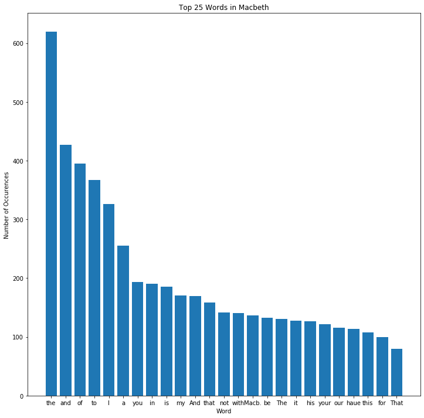

# Project: Analyzing Macbeth

## Introduction
I'm going to do some simple analysis of Shakespeare's play, 'Macbeth'. Aspects that will be covered include:
* Practice working with lists and dictionaries 
* Conditionals
* Visualizing data 
* Thinking analytically about data

## Objectives
* Apply string methods to make changes to a string
* Use a `for` loop to iterate over a collection
* Assign values in a dictionary

## Getting the Data
I will start by importing `requests` to pull the transcript of Macbeth from the [Project Gutenberg](https://www.gutenberg.org/) website. I'll also preview a few details about what is stored in the variable `macbeth`. 


```python
import requests
macbeth = requests.get('http://www.gutenberg.org/cache/epub/2264/pg2264.txt').text
#See the type and length of the transcript
print(type(macbeth))
print(len(macbeth))
#Print the first 500 characters
print(macbeth[:500])
```

    <class 'str'>
    120253
    
    
    ***The Project Gutenberg's Etext of Shakespeare's First Folio***
    ********************The Tragedie of Macbeth*********************
    
    
    
    *******************************************************************
    THIS EBOOK WAS ONE OF PROJECT GUTENBERG'S EARLY FILES PRODUCED AT A
    TIME WHEN PROOFING METHODS AND TOOLS WERE NOT WELL DEVELOPED. THERE
    IS AN IMPROVED EDITION OF THIS TITLE WHICH MAY BE VIEWED AS EBOOK
    (#1533) at https://www.gutenberg.org/ebooks/1533
    *********************************


```python
import numpy as np
import matplotlib.pyplot as plt
%matplotlib inline
words = macbeth.split()
word_counts = {}
for word in words:
    word_counts[word] = word_counts.get(word, 0) + 1
```


```python
counts = list(word_counts.items())
top_25 = sorted(counts, key = lambda x: x[1], reverse=True)[:25]
y = [item[1] for item in top_25]
X = np.arange(len(y))
plt.figure(figsize=(12,12))
plt.bar(X,y)
plt.xticks(X, [item[0] for item in top_25]);
plt.ylabel('Number of Occurences')
plt.xlabel('Word')
plt.title('Top 25 Words in Macbeth')
```


    Text(0.5, 1.0, 'Top 25 Words in Macbeth')





